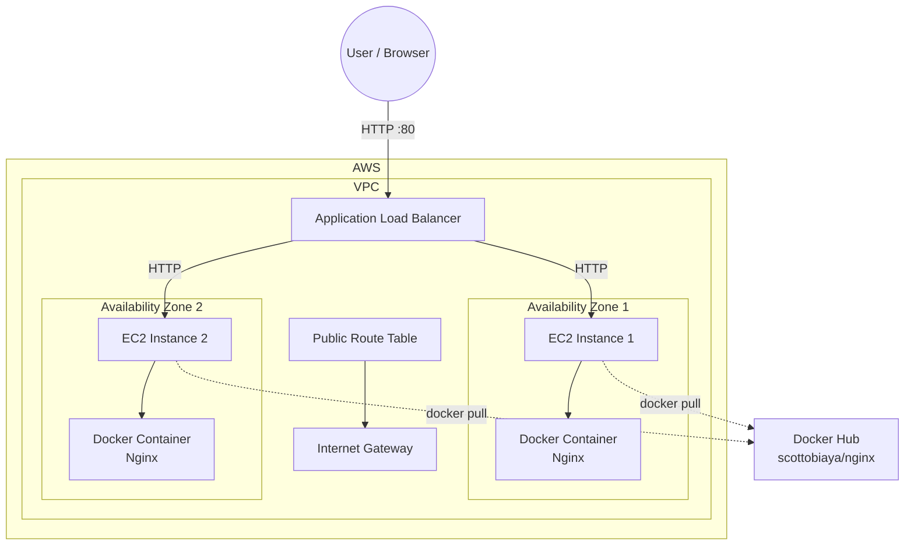

# AWS Terraform Docker Deployment

This project uses Terraform to provision an AWS environment running a containerised Nginx application.

The infrastructure consists of a VPC with two public subnets, two EC2 instances, an Application Load Balancer, and a Docker image hosted on Docker Hub.

Terraform is responsible for creating the AWS infrastructure. During instance startup, the EC2 instances install Docker and pull the application image from Docker Hub. The application then runs inside a Docker container.

## Architecture



### Request Flow

1. A user sends an HTTP request to the Application Load Balancer.
2. The Load Balancer distributes the request between the two EC2 instances.
3. Each EC2 instance runs the application inside a Docker container.
4. Nginx inside the container handles the HTTP request.
5. The response is returned through the Load Balancer to the user.

### Image Deployment Flow

The Docker image is built and pushed to Docker Hub separately from the AWS infrastructure.

When a new EC2 instance is created:

```text
Terraform
   |
   v
EC2 Instance
   |
   v
Install Docker
   |
   v
docker pull
   |
   v
Docker Hub
   |
   v
Run Container
   |
   v
Nginx Application
```

The EC2 instance does not build the Docker image itself. It pulls the already-built image from Docker Hub.

---

## Infrastructure

Terraform provisions the following AWS resources:

* VPC
* Two public subnets
* Internet Gateway
* Public route table
* Security group
* Two EC2 instances
* Application Load Balancer
* Target group
* Load Balancer listener
* Target group attachments

The two EC2 instances are placed in separate Availability Zones and are registered with the Application Load Balancer.

---

## Project Structure

```text
new-project/
│
├── docker/
│   └── Dockerfile
│
├── scripts/
│   └── server-setup.sh
│
├── .gitignore
├── .terraform.lock.hcl
├── README.md
├── main.tf
├── provider.tf
└── variables.tf
```

### Docker

The `docker` directory contains the Dockerfile used to build the application image.

```text
docker/
└── Dockerfile
```

The image is built locally and pushed to Docker Hub.

For example:

```bash
docker build -t scottobiaya/nginx:latest ./docker
docker push scottobiaya/nginx:latest
```

The EC2 instances then pull this image during startup.

---

## EC2 Startup Configuration

The `server-setup.sh` script is used as the EC2 user-data script.

It performs the basic server configuration required when a new instance is launched.

The script:

1. Updates the Ubuntu package repository.
2. Installs Docker.
3. Enables and starts the Docker service.
4. Pulls the Docker image from Docker Hub.
5. Starts the application container.
6. Configures the container to restart automatically.

The EC2 instance therefore only needs Docker installed. The application itself comes from Docker Hub.

---

## Docker Image

The application image is stored in Docker Hub.

The image contains the Nginx web server and the files required by the application.

The deployment model is:

```text
Local Development
       |
       v
Docker Build
       |
       v
Docker Image
       |
       v
Docker Hub
       |
       v
EC2 Instance
       |
       v
Docker Pull
       |
       v
Running Container
```

This separates the application image from the AWS infrastructure.

---

## Terraform Variables

The main configurable values are stored in `variables.tf`.

Typical variables include:

```text
cidr_block
key_name
docker_image
```

The `docker_image` variable determines which Docker Hub image the EC2 instances should pull.

For example:

```text
scottobiaya/nginx:latest
```

This means the Docker image can be changed without modifying the AWS infrastructure configuration.

---

## Prerequisites

Before deploying the project, make sure the following are installed:

* Terraform
* AWS CLI
* Git
* Docker
* An AWS account
* An AWS IAM user or role with permission to create the required resources

AWS credentials must also be configured on the machine running Terraform.

Check the AWS configuration with:

```bash
aws sts get-caller-identity
```

---

## Deployment

Clone the repository:

```bash
git clone https://github.com/scottobiaya/new-project.git
cd new-project
```

Initialise Terraform:

```bash
terraform init
```

Validate the configuration:

```bash
terraform validate
```

Review the planned infrastructure:

```bash
terraform plan
```

Apply the configuration:

```bash
terraform apply
```

Terraform will create the AWS resources and configure the EC2 instances.

After deployment, Terraform will output the relevant information, including the Load Balancer address if it is defined as an output.

Open the Load Balancer address in a web browser:

```text
http://<LOAD_BALANCER_DNS_NAME>
```

---

## Checking the Deployment

To check the Terraform resources:

```bash
terraform state list
```

To connect to an EC2 instance:

```bash
ssh -i <key-file> ubuntu@<EC2_PUBLIC_IP>
```

Check that Docker is running:

```bash
sudo systemctl status docker
```

Check the running containers:

```bash
sudo docker ps
```

Check the Docker image:

```bash
sudo docker images
```

Check the application container logs:

```bash
sudo docker logs <container-name>
```

---

## Updating the Application

The application can be updated without changing the Terraform infrastructure.

Build a new Docker image:

```bash
docker build -t scottobiaya/nginx:<version> ./docker
```

Push the image to Docker Hub:

```bash
docker push scottobiaya/nginx:<version>
```

Update the `docker_image` Terraform variable to use the new image version.

For example:

```text
scottobiaya/nginx:v2
```

Then run:

```bash
terraform plan
terraform apply
```

For production use, immutable image tags such as `v1`, `v2`, or a Git commit SHA are preferable to relying only on `latest`.

---

## Destroying the Infrastructure

When the environment is no longer required, the AWS resources can be removed with:

```bash
terraform destroy
```

Review the resources Terraform plans to remove and confirm the operation.

---

## Technologies Used

* AWS
* Terraform
* EC2
* Application Load Balancer
* Docker
* Docker Hub
* Nginx
* Ubuntu Linux
* Git / GitHub

---

## Project Architecture Summary

The project demonstrates a simple infrastructure-as-code deployment where Terraform manages the AWS infrastructure while Docker manages the application runtime.

The separation between infrastructure and application deployment is intentional:

```text
Terraform
    |
    +-- AWS Infrastructure
    |
    +-- EC2 Configuration
              |
              +-- Docker
                    |
                    +-- Pull Image
                           |
                           +-- Docker Hub
```

This approach makes it possible to rebuild the AWS environment using Terraform while keeping the application packaged and distributed as a Docker image.
