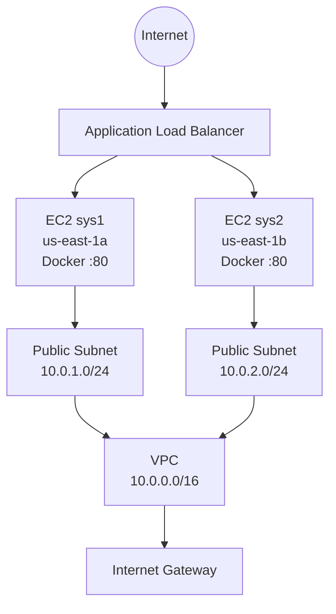

# AWS Terraform Docker Project

This project creates a small AWS environment using Terraform and runs a Docker application on two EC2 instances.

The two servers are placed in different Availability Zones and traffic is distributed between them using an Application Load Balancer.

## Architecture



The basic flow is:

Internet → Application Load Balancer → EC2 instances → Docker container

The infrastructure is created with Terraform.

## What this project creates

- VPC
- Two public subnets
- Internet Gateway
- Public route table
- Security group
- Two EC2 instances
- Application Load Balancer
- Target group
- HTTP listener

The EC2 instances are created in:

- us-east-1a
- us-east-1b

Both instances run the application inside a Docker container.

## Project structure

```text
new-project/
├── main.tf
├── provider.tf
├── variables.tf
├── .terraform.lock.hcl
├── docker/
│   ├── Dockerfile
│   └── start.sh
├── scripts/
│   └── server-setup.sh
├── .gitignore
└── README.md
```

## Terraform

Initialize the project:

```bash
terraform init
```

Format the Terraform files:

```bash
terraform fmt
```

Validate the configuration:

```bash
terraform validate
```

Review the infrastructure before creating it:

```bash
terraform plan
```

Create the infrastructure:

```bash
terraform apply
```

To remove the infrastructure:

```bash
terraform destroy
```

## Docker

The Docker files are located in:

```text
docker/
├── Dockerfile
└── start.sh
```

The Docker image is passed to the EC2 setup script using the `docker_image` Terraform variable.

## EC2 setup

The EC2 instances are configured during launch using:

```text
scripts/server-setup.sh
```

Terraform uses this script as EC2 `user_data`.

## Security

This is a lab/portfolio project. SSH and HTTP are currently open to the internet.

For a production environment, SSH should be restricted to trusted IP addresses or replaced with AWS Systems Manager.

The EC2 security group should also be restricted so that application traffic is accepted only from the Application Load Balancer.

## Terraform state

Terraform state files are not committed to Git.

The `.gitignore` file excludes:

```text
.terraform/
*.tfstate
*.tfstate.*
*.tfvars
```

The Terraform provider lock file is committed:

```text
.terraform.lock.hcl
```

## Technologies

- AWS
- Terraform
- Docker
- Linux
- Bash
- Git
- GitHub