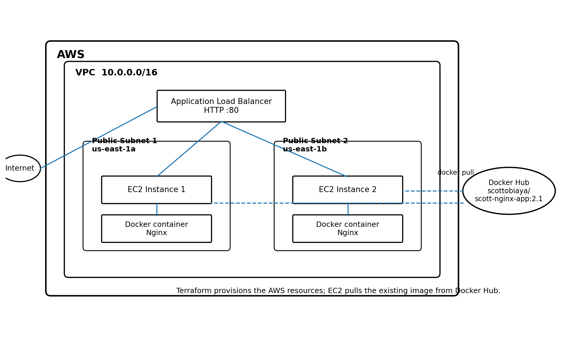
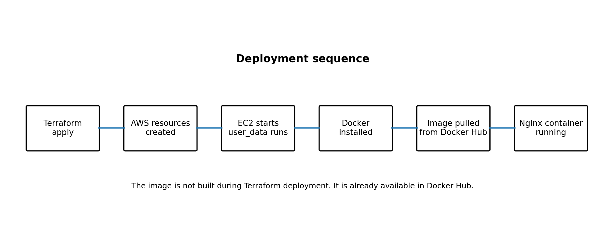

# AWS Terraform Docker Nginx Deployment

This project uses Terraform to create an AWS environment and deploy an Nginx application running in Docker.

The infrastructure consists of two EC2 instances in different Availability Zones behind an Application Load Balancer (ALB).

The Docker image is stored in Docker Hub. When each EC2 instance is created, its setup script installs Docker, pulls the image from Docker Hub, and starts the Nginx container.

Terraform is responsible for creating and connecting the AWS infrastructure.

---

## Architecture

The following diagram shows the AWS infrastructure and how the different components are connected.



The architecture consists of:

- AWS VPC
- Two public subnets in different Availability Zones
- Two EC2 instances
- Docker running on each EC2 instance
- Nginx running inside Docker containers
- Application Load Balancer
- Internet Gateway
- Docker Hub for storing the Docker image

The Application Load Balancer receives HTTP requests from the internet and distributes them between the two EC2 instances.

Each EC2 instance runs the same Docker image. Terraform provides a different server message to each instance so that the response can be used to identify which EC2 instance served the request.

---

## Deployment Flow

The following diagram shows the deployment process from the Docker image through to the running application.



The deployment process is:

```text
Developer
    |
    | Build Docker image
    v
Docker
    |
    | Push image
    v
Docker Hub
    |
    | Terraform apply
    v
AWS
    |
    +-------------------------+
    |                         |
    v                         v
EC2 Instance 1          EC2 Instance 2
    |                         |
    | Install Docker          | Install Docker
    |                         |
    | Pull Docker image       | Pull Docker image
    |                         |
    | Run container           | Run container
    v                         v
Nginx Container          Nginx Container
    |                         |
    +------------+------------+
                 |
                 v
       Application Load Balancer
                 |
                 v
              Internet
```

---

# Project Structure

```text
new-project/
│
├── .gitignore
├── .terraform.lock.hcl
├── README.md
├── main.tf
├── provider.tf
├── variables.tf
│
├── docker/
│   ├── Dockerfile
│   └── start.sh
│
├── scripts/
│   └── server-setup.sh
│
└── doc/
    ├── architecture.png
    └── deployment-flow.png
```

### File and folder descriptions

| File / Folder | Purpose |
|---|---|
| `main.tf` | Creates the AWS infrastructure |
| `provider.tf` | Configures the AWS Terraform provider |
| `variables.tf` | Defines Terraform variables |
| `scripts/server-setup.sh` | Installs Docker and starts the Docker container on each EC2 instance |
| `docker/Dockerfile` | Defines the Nginx Docker image |
| `docker/start.sh` | Creates the Nginx web page inside the container |
| `doc/architecture.png` | AWS architecture diagram |
| `doc/deployment-flow.png` | Deployment flow diagram |
| `.terraform.lock.hcl` | Locks Terraform provider versions |
| `.gitignore` | Prevents Terraform state and other unwanted files from being committed |
| `README.md` | Project documentation |

---

# AWS Infrastructure

Terraform creates the following AWS resources:

- VPC
- Internet Gateway
- Two public subnets
- Public route table
- Route table associations
- Security group
- Two EC2 instances
- Application Load Balancer
- ALB target group
- ALB listener
- Target group attachments

The EC2 instances are deployed into different Availability Zones to provide basic availability if one Availability Zone becomes unavailable.

---

# Network Architecture

The project creates a VPC with two public subnets.

```text
                         Internet
                            |
                            |
                    Internet Gateway
                            |
                          VPC
                            |
             ---------------------------
             |                         |
       Public Subnet 1           Public Subnet 2
       us-east-1a                us-east-1b
             |                         |
          EC2 #1                    EC2 #2
             \                         /
              \                       /
               Application Load Balancer
```

Both EC2 instances have public IP addresses so that they can access the internet and pull the Docker image from Docker Hub.

The Application Load Balancer is internet-facing.

---

# Terraform

## Terraform Provider

The project uses the AWS provider.

The AWS region used by the project is:

```text
us-east-1
```

Terraform does not use the TLS provider for this project.

---

# Variables

The project uses variables for values that may change between deployments.

The main variables include:

```text
cidr_block
key_name
```

### cidr_block

Defines the CIDR block for the VPC.

Example:

```text
10.0.0.0/16
```

### key_name

Specifies the name of the existing AWS EC2 key pair used for SSH access.

Example:

```text
terraform-ec2-key
```

The key pair is created separately in AWS and referenced by Terraform.

---

# Docker Architecture

The Docker image contains Nginx.

The Docker image is built separately and pushed to Docker Hub.

The EC2 instances do not build the Docker image themselves.

Instead, the EC2 setup process performs the following:

```text
EC2 starts
   |
   v
Install Docker
   |
   v
Start Docker service
   |
   v
docker pull <docker_image>
   |
   v
docker run
   |
   v
Nginx container starts
```

This means the Docker image does not need to be rebuilt every time an EC2 instance is created.

---

# Dockerfile

The Dockerfile defines the Docker image.

The Dockerfile is located at:

```text
docker/Dockerfile
```

Example:

```dockerfile
FROM nginx:latest

COPY start.sh /start.sh

RUN chmod +x /start.sh

CMD ["/start.sh"]
```

The image is based on the official Nginx image.

The `start.sh` script is copied into the container and executed when the container starts.

---

# start.sh

The `start.sh` script creates the web page served by Nginx.

The script is located at:

```text
docker/start.sh
```

Example:

```bash
#!/bin/bash

cat > /usr/share/nginx/html/index.html <<EOF
<!DOCTYPE html>
<html>
<head>
    <title>Scott Nginx</title>
</head>
<body>
    <h1>Scott Nginx Docker Application</h1>
    <p>${SERVER_MESSAGE}</p>
</body>
</html>
EOF

nginx -g "daemon off;"
```

The `SERVER_MESSAGE` environment variable is supplied when the Docker container is started.

For example:

```text
SERVER_MESSAGE="scott server 1"
```

or:

```text
SERVER_MESSAGE="scott server 2"
```

This makes it possible to identify which EC2 instance served the request.

---

# Docker Hub

The Docker image is stored in Docker Hub.

Example:

```text
scottobiaya/scott-nginx:latest
```

The image should be built and pushed before Terraform creates the EC2 instances.

Build the Docker image:

```bash
docker build -t scottobiaya/scott-nginx:latest ./docker
```

Log in to Docker Hub:

```bash
docker login
```

Push the image:

```bash
docker push scottobiaya/scott-nginx:latest
```

After the image has been pushed, the EC2 instances can pull it using:

```bash
docker pull scottobiaya/scott-nginx:latest
```

---

# Docker Hub Authentication

The current architecture assumes that the Docker image is publicly accessible on Docker Hub.

Therefore, the EC2 instances do not need to log in to Docker Hub before pulling the image.

For a public image, this works:

```bash
docker pull scottobiaya/scott-nginx:latest
```

If the Docker Hub repository is private, authentication would need to be added to the EC2 setup process.

For this project, the image is intended to be publicly accessible so that the EC2 instances can pull it during startup.

---

# EC2 Server Setup

The EC2 instances use:

```text
scripts/server-setup.sh
```

The setup script is supplied to the EC2 instances through Terraform user data.

The setup process performs the following tasks:

1. Updates the Ubuntu package repository.
2. Installs Docker.
3. Installs curl.
4. Starts Docker.
5. Enables Docker to start automatically.
6. Pulls the Docker image from Docker Hub.
7. Starts the Docker container.
8. Configures the container to restart automatically.
9. Maps port 80 on the EC2 instance to port 80 inside the container.

The deployment process is:

```text
Terraform creates EC2
        |
        v
server-setup.sh runs
        |
        v
Docker installed
        |
        v
Docker service started
        |
        v
Docker image pulled from Docker Hub
        |
        v
Docker container started
        |
        v
Nginx listens on port 80
```

---

# Security Group

The EC2 security group allows the traffic required by the application.

HTTP traffic is allowed on:

```text
TCP 80
```

SSH can also be allowed on:

```text
TCP 22
```

SSH access should ideally be restricted to a trusted IP address rather than allowing SSH from everywhere.

The Application Load Balancer security group allows HTTP traffic from the internet.

The EC2 security group can be configured so that application traffic is accepted from the load balancer.

---

# Application Load Balancer

Terraform creates an internet-facing Application Load Balancer.

The ALB listens on:

```text
HTTP :80
```

The ALB forwards requests to the target group containing the two EC2 instances.

```text
Client
  |
  v
ALB :80
  |
  +------------+
  |            |
  v            v
EC2 #1       EC2 #2
:80          :80
  |            |
Docker       Docker
  |            |
Nginx        Nginx
```

---

# Target Group

The target group contains both EC2 instances.

The target group uses HTTP on port 80.

The load balancer performs health checks against the EC2 instances to determine whether they are available to receive traffic.

If an instance fails its health check, the ALB can stop sending requests to that instance.

---

# Deployment

## 1. Clone the Repository

Clone the GitHub repository:

```bash
git clone https://github.com/scottobiaya/new-project.git
```

Move into the project directory:

```bash
cd new-project
```

---

## 2. Check the Project Files

Make sure the directory contains:

```text
new-project/
├── .gitignore
├── .terraform.lock.hcl
├── README.md
├── main.tf
├── provider.tf
├── variables.tf
├── docker/
│   ├── Dockerfile
│   └── start.sh
├── scripts/
│   └── server-setup.sh
└── doc/
    ├── architecture.png
    └── deployment-flow.png
```

The `doc` folder should contain both image files:

```text
doc/architecture.png
doc/deployment-flow.png
```

The images are referenced from this README using relative paths, so they will also display correctly when the README is viewed on GitHub.

---

# 3. Build the Docker Image

From the root of the project:

```bash
docker build -t scottobiaya/scott-nginx:latest ./docker
```

Check the image:

```bash
docker images
```

---

# 4. Test the Docker Image Locally

Run the container:

```bash
docker run -d \
  --name scott-nginx \
  -p 8080:80 \
  -e SERVER_MESSAGE="Local Docker Test" \
  scottobiaya/scott-nginx:latest
```

Check the running container:

```bash
docker ps
```

Open:

```text
http://localhost:8080
```

The Nginx page should be displayed.

To stop the container:

```bash
docker stop scott-nginx
```

To remove it:

```bash
docker rm scott-nginx
```

---

# 5. Push the Docker Image to Docker Hub

Log in:

```bash
docker login
```

Push the image:

```bash
docker push scottobiaya/scott-nginx:latest
```

Verify that the image is available in Docker Hub before continuing with Terraform.

---

# 6. Configure AWS Credentials

Terraform needs permission to create AWS resources.

AWS credentials can be configured using the AWS CLI.

Check that AWS is configured:

```bash
aws sts get-caller-identity
```

The command should return information about the AWS account and IAM identity being used.

---

# 7. Initialize Terraform

From the root of the project:

```bash
terraform init
```

Terraform downloads the required provider and initializes the working directory.

---

# 8. Validate Terraform

Run:

```bash
terraform validate
```

Expected result:

```text
Success! The configuration is valid.
```

---

# 9. Format Terraform

Run:

```bash
terraform fmt
```

This formats the Terraform configuration files.

---

# 10. Review the Terraform Plan

Run:

```bash
terraform plan
```

If Terraform asks for the Docker image, provide:

```text
scottobiaya/scott-nginx:latest
```

The plan should show the AWS resources that Terraform intends to create.

Review the plan before applying it.

---

# 11. Create the Infrastructure

Run:

```bash
terraform apply
```

Terraform will ask for confirmation.

Enter:

```text
yes
```

Terraform will then create the AWS infrastructure.

---

# 12. Wait for the EC2 Instances

After Terraform creates the instances, the EC2 user-data script will run automatically.

The setup process will:

```text
Install Docker
      |
      v
Start Docker
      |
      v
Pull Docker image
      |
      v
Run Nginx container
```

The initial setup can take several minutes.

---

# 13. Check the EC2 Instances

In the AWS EC2 console, verify that both instances are running.

Each instance should show:

```text
Instance state: Running
Status checks: Passed
```

---

# 14. Check Docker on an EC2 Instance

SSH into an instance using the EC2 key pair.

Example:

```bash
ssh -i terraform-ec2-key.pem ubuntu@<EC2_PUBLIC_IP>
```

Check Docker:

```bash
sudo systemctl status docker
```

Check the running container:

```bash
sudo docker ps
```

The Nginx container should be running.

---

# 15. Test the EC2 Application

From the EC2 instance, run:

```bash
curl http://localhost
```

The response should contain the Nginx application page.

You can also test the EC2 public IP:

```text
http://<EC2_PUBLIC_IP>
```

---

# 16. Check the Load Balancer

Find the DNS name of the Application Load Balancer in the AWS console.

It will look similar to:

```text
my-load-balancer-123456789.us-east-1.elb.amazonaws.com
```

Open:

```text
http://<ALB-DNS-NAME>
```

The application should be displayed.

---

# 17. Test Load Balancing

Because there are two EC2 instances, the ALB can distribute requests between them.

Run:

```bash
curl http://<ALB-DNS-NAME>
```

Run it several times.

The response may show different server messages, for example:

```text
scott server 1
```

and:

```text
scott server 2
```

This demonstrates that the Application Load Balancer is distributing requests between the two EC2 instances.

---

# Troubleshooting

## Docker Container Is Not Running

SSH into the EC2 instance and run:

```bash
sudo docker ps -a
```

Check the container logs:

```bash
sudo docker logs scott-nginx
```

---

## Docker Image Cannot Be Pulled

Run:

```bash
sudo docker pull scottobiaya/scott-nginx:latest
```

If the pull fails, check:

- The Docker image name.
- The Docker Hub repository name.
- The image tag.
- The Docker Hub repository visibility.
- Internet connectivity from the EC2 instance.
- Whether Docker is running.

---

## Check Docker Service

Run:

```bash
sudo systemctl status docker
```

If Docker is not running:

```bash
sudo systemctl start docker
```

---

## Check the EC2 Setup Script

The EC2 setup script can be inspected using:

```bash
sudo cat /var/log/cloud-init-output.log
```

This is useful for finding errors that occurred while Terraform user data was executing.

---

## ALB Target Is Unhealthy

Check the AWS Target Groups section.

The EC2 instances should show:

```text
Healthy
```

If an instance is unhealthy, check:

```bash
sudo docker ps
```

Then:

```bash
curl http://localhost
```

Also verify that port 80 is allowed by the appropriate security group.

---

# Updating the Docker Application

When the application changes, rebuild the Docker image:

```bash
docker build -t scottobiaya/scott-nginx:latest ./docker
```

Push the new image:

```bash
docker push scottobiaya/scott-nginx:latest
```

The existing EC2 containers will not automatically pull the new image simply because Docker Hub has been updated.

To deploy the new image to existing instances, the deployment process needs to pull the new image and recreate the containers, or the EC2 instances need to be recreated so that the setup script runs again.

A future CI/CD implementation could automate this process.

---

# Terraform State

Terraform creates state files to keep track of the infrastructure it manages.

The main Terraform state file is:

```text
terraform.tfstate
```

Terraform may also create:

```text
terraform.tfstate.backup
```

These files should not normally be committed to GitHub.

The `.gitignore` file should therefore include:

```text
.terraform/
*.tfstate
*.tfstate.*
*.tfvars
*.tfvars.json
crash.log
crash.*.log
```

The `.terraform.lock.hcl` file should normally be committed because it locks the provider versions used by Terraform.

---

# Destroying the Infrastructure

When the project is no longer required, the AWS resources can be removed using:

```bash
terraform destroy
```

Terraform will display the resources that will be destroyed.

Enter:

```text
yes
```

Terraform will then remove the infrastructure it created.

This is important because AWS resources such as EC2 instances and Application Load Balancers can generate charges while they are running.

---

# Important Notes

## Terraform

Terraform creates and manages the AWS infrastructure.

Terraform does not build the Docker image in this architecture.

---

## Docker

Docker runs on the EC2 instances.

The EC2 instances pull the Docker image from Docker Hub.

---

## Docker Hub

Docker Hub stores the application image.

The EC2 instances pull the image during startup.

---

## Nginx

Nginx runs inside the Docker container.

Nginx listens on port 80 inside the container.

Docker maps the container's port 80 to port 80 on the EC2 instance.

---

## Application Load Balancer

The ALB receives HTTP requests and distributes them between the two EC2 instances.

---

# Complete Deployment Flow

The complete deployment process is:

```text
Developer
    |
    | Build Docker image
    v
Docker
    |
    | Push image
    v
Docker Hub
    |
    | Terraform apply
    v
AWS
    |
    +-----------------------------+
    |                             |
    v                             v
EC2 Instance 1              EC2 Instance 2
    |                             |
    | Install Docker              | Install Docker
    |                             |
    | Pull image                  | Pull image
    |                             |
    | Run container               | Run container
    v                             v
Nginx Container              Nginx Container
    |                             |
    +-------------+---------------+
                  |
                  v
        Application Load Balancer
                  |
                  v
               Internet
```

---

# Technologies Used

- AWS
- Terraform
- Amazon EC2
- Application Load Balancer
- Amazon VPC
- Docker
- Docker Hub
- Nginx
- Ubuntu Linux
- Git
- GitHub

---

# Future Improvements

Possible future improvements include:

- Use private subnets for the EC2 instances.
- Use a NAT Gateway for outbound internet access.
- Store the Docker image in Amazon ECR.
- Use IAM roles instead of static AWS credentials.
- Add HTTPS using AWS Certificate Manager.
- Restrict EC2 security group access to the ALB security group.
- Add Auto Scaling Groups.
- Add CloudWatch monitoring.
- Add a CI/CD pipeline.
- Automatically deploy new Docker image versions.
- Use remote Terraform state in Amazon S3.
- Add state locking.
- Use separate Terraform environments for development, staging and production.

---

# Project Summary

This project demonstrates how Terraform can be used to provision AWS infrastructure and deploy a containerized Nginx web application.

Terraform creates the networking, EC2 instances, security groups, Application Load Balancer and target group.

Docker Hub stores the application image.

When the EC2 instances are created, the `server-setup.sh` script installs Docker, pulls the Docker image from Docker Hub and starts the Nginx container.

The Application Load Balancer distributes HTTP requests between the two EC2 instances.

The architecture provides a simple and repeatable infrastructure-as-code deployment for a Dockerized web application.
